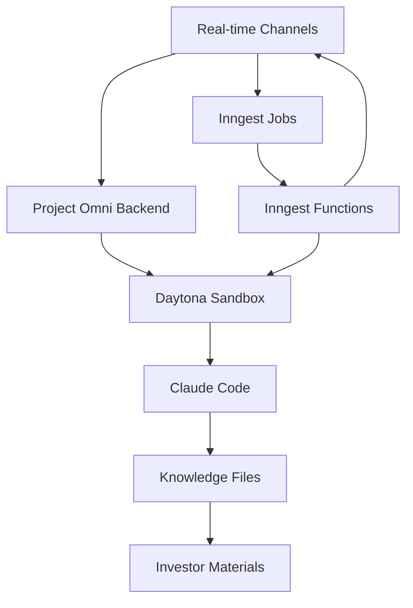

# Project Omni MVP Implementation Plan

## Executive Summary

**Objective**: Deliver a functional web MVP for design partner testing in 2-3 days by adapting the existing VibeKit codex-clone template rather than building from scratch.

**Core Strategy**: Leverage the proven UI patterns and infrastructure from codex-clone while integrating with Project Omni's existing backend for founder-specific knowledge processing and investor material generation.

**Key Decision**: Use hybrid Inngest + WebSocket architecture for job durability and real-time streaming, maintaining the "Ask/Process" dual-mode interface for querying accumulated knowledge vs processing new brain dumps.

---

## Current State Analysis

### ✅ **Backend Ready** (Project Omni Server)
- Bun + TypeScript + Effect architecture
- Daytona sandbox orchestration with Claude Code 1.0.80
- WebSocket streaming for real-time feedback (`/ws`)
- REST API endpoints (`/api/sandbox/create`, `/api/knowledge/process`)
- Structured "knowledge as code" filesystem in sandboxes
- Single sandbox per user with automatic reuse/management

### ❌ **Critical Gap** 
- **No user interface** - design partners cannot test the value proposition
- Backend processing works but requires manual API calls

### ✅ **Available Foundation** (VibeKit codex-clone)
- Complete Next.js + React UI with task management
- Real-time streaming interface with message display
- Zustand state management with persistence
- Inngest job orchestration with durability
- Professional UI components and styling

---

## MVP Strategy & Rationale

### Why Adapt codex-clone vs Build From Scratch

**Time Advantage**: 2-3 days vs 2-3 weeks
- ✅ Task input interface already built
- ✅ Real-time streaming UI with message display
- ✅ State management with error handling
- ✅ Professional styling and components
- ✅ Job orchestration infrastructure

**Design Partner Focus**: What founders actually care about
- ✅ Easy input of thoughts/brain dumps
- ✅ Quality of investor-ready output
- ✅ Speed vs doing manually
- ❌ Mobile interface (post-MVP priority)

**Validation-First Approach**: Test core value proposition before building custom experience

---

## Technical Architecture

### Pure Inngest Architecture (Implemented)



### Key Components Integration

1. **Frontend** (Adapted codex-clone)
   - Task input for founder brain dumps
   - Real-time streaming display
   - Dual-mode: Process (new knowledge) + Ask (query existing)

2. **Job Orchestration** (Pure Inngest Architecture)
   - Inngest handles job durability, retries, complex workflows
   - Inngest functions execute Claude Code within Daytona sandboxes
   - Real-time streaming via Inngest channels during processing

3. **Knowledge Processing** (Existing Project Omni Pipeline)
   - Structured filesystem as working memory
   - Entity extraction and pattern recognition
   - Investor-grade document generation

### Data Flow

```
1. User Input (Brain dump/Query) 
   ↓
2. Frontend → Inngest Job Creation
   ↓  
3. Inngest → Project Omni API (/api/knowledge/process)
   ↓
4. Backend → Sandbox Creation/Reuse (single per user)
   ↓
5. Claude Code → Knowledge Processing
   ↓
6. WebSocket → Real-time Streaming to Frontend
   ↓
7. Results → Structured Knowledge + Investor Materials
```

---

## Implementation Plan

### Phase 1: Foundation Setup (Day 1)
1. Copy codex-clone template to new `frontend/` directory
2. Remove VibeKit SDK and GitHub-specific dependencies
3. Update package.json with Project Omni integration dependencies
4. Create Project Omni API client replacing VibeKit integration

### Phase 2: Core Integration (Day 2)  
1. Implement hybrid Inngest + WebSocket client
2. Modify task form for founder-specific input patterns
3. Update state management for single-sandbox model
4. Create Project Omni backend integration endpoints

### Phase 3: UI Customization (Day 2-3)
1. Update task display for investor materials output
2. Customize messaging and branding for founder context
3. Add sandbox status management
4. Test end-to-end flow with design partner scenarios

---

## File-by-File Modification Guide

### New Files to Create

```
frontend/
├── lib/
│   ├── omni-api.ts          # Project Omni REST client
│   ├── omni-websocket.ts    # WebSocket integration
│   └── omni-inngest.ts      # Inngest → Omni bridge
├── stores/
│   └── sandbox.ts           # Single sandbox state management
└── app/actions/
    └── omni.ts              # Server actions for Omni integration
```

### Files to Modify

#### `app/_components/task-form.tsx`
```tsx
// REMOVE:
- GitHub repository selection
- Branch selection  
- Environment management
- Complex form validation

// MODIFY:
- Placeholder: "Share your thoughts on metrics, challenges, wins, strategic plans..."
- Button labels: "Process" (brain dump) / "Ask" (query knowledge)
- Add sandbox status check before submission

// ADD:
- Founder-specific input hints
- Processing mode selection context
```

#### `stores/tasks.ts`
```tsx
// REMOVE:
- Repository and branch fields
- GitHub-specific metadata

// MODIFY:
interface Task {
  id: string
  title: string
  mode: "process" | "ask"  // Changed from "code" | "ask"
  input: string           // Raw founder input
  sandboxId: string       // Associated sandbox
  deliverables: string[]  // Generated investor materials
  // ... existing fields
}

// ADD:
- Sandbox integration
- Deliverable tracking
```

#### `stores/sandbox.ts` (New)
```tsx
interface SandboxStore {
  currentSandbox: Sandbox | null
  status: 'idle' | 'creating' | 'ready' | 'error'
  error?: string
  
  createSandbox: (userId: string) => Promise<void>
  getSandboxStatus: () => Promise<void>
}
```

#### `package.json`
```json
// REMOVE:
- "@vibe-kit/sdk"
- GitHub OAuth packages (initially)

// KEEP:
- "@inngest/realtime"
- "inngest" 
- All UI and React dependencies
- Zustand state management

// ADD:
- Any Project Omni specific clients if needed
```

---

## Inngest Event Integration (Actual Implementation)

### Frontend Event Sending

```typescript
// frontend/app/actions/inngest.ts

import { inngest } from "@/lib/inngest"
import { Task } from "@/stores/tasks"

export const createTaskAction = async ({
  task,
  prompt,
}: {
  task: Task;
  prompt?: string;
}) => {
  const userId = process.env.NEXT_PUBLIC_DEV_USER_ID;
  
  if (!userId) {
    throw new Error("No user ID configured. Set NEXT_PUBLIC_DEV_USER_ID in environment.");
  }

  // Send Inngest event to trigger backend task creation flow
  await inngest.send({
    name: "omni/create.task",
    data: {
      task,
      userId,
      prompt: prompt || task.title,
    },
  });
};
```

### Backend Function Implementation

```typescript
// server/src/services/inngest.ts

// Task creation function - handles frontend task creation requests
export const createTask = inngest.createFunction(
  { id: "create-task" },
  { event: "omni/create.task" },
  async ({ event, step }) => {
    const { task, userId, prompt } = event.data;
    
    try {
      // Step 1: Create/ensure sandbox exists and is ready
      const sandbox = await step.run("ensure-sandbox", async () => {
        return await createSandbox(userId);
      });
      
      // Step 2: Trigger knowledge processing
      await step.run("trigger-processing", async () => {
        const jobId = `job_${Date.now()}_${Math.random().toString(36).slice(2, 8)}`;
        
        await inngest.send({
          name: "omni/process.knowledge",
          data: {
            taskId: task.id,
            sandboxId: sandbox.id,
            userId,
            input: prompt,
            model: "sonnet",
            jobId,
          },
        });
        
        return { jobId, accepted: true };
      });
    } catch (error) {
      console.error("❌ Task creation failed:", error);
      throw error;
    }
  }
)
```

### Real-time Streaming Implementation

```typescript
// server/src/services/inngest.ts (processKnowledge function)

// Real-time streaming via Inngest channels
export const processKnowledge = inngest.createFunction(
  { id: "process-knowledge" },
  { event: "omni/process.knowledge" },
  async ({ event, step, publish }) => {
    const { taskId, sandboxId, userId, input, model, jobId } = event.data;
    
    try {
      // Send initial status
      await publish(
        taskChannel().update({
          taskId,
          message: {
            type: "log",
            data: "job started",
            jobId,
            ts: Date.now(),
          }
        })
      )

      // Execute Claude processing
      const result = await step.run("claude-processing", async () => {
        // ... Claude Code execution logic
        
        // Real-time log streaming
        await publish(
          taskChannel().update({
            taskId,
            message: {
              type: "result",
              format: "text",
              data: claudeResponse.result,
              jobId,
              ts: Date.now(),
            }
          })
        )
        
        return { success: true, result: claudeResponse.result }
      })
      
      return result
    } catch (error) {
      // Error handling with real-time updates
      await publish(
        taskChannel().update({
          taskId,
          message: {
            type: "error",
            code: "EXECUTION_ERROR",
            message: String(error),
            jobId,
            ts: Date.now(),
          }
        })
      )
    }
  }
)
```

---

## State Management Strategy

### Single Sandbox Model

Unlike codex-clone's multi-environment approach, Project Omni uses **one sandbox per user**:

```typescript
// Backend already implements this pattern:
const userPreferred = new Map<string, string>() // userId -> sandboxId

// Frontend should mirror this:
interface SandboxStore {
  currentSandbox: Sandbox | null  // Single sandbox
  // No arrays or complex sandbox management needed
}
```

### Task Flow Adaptation

```typescript
// Existing codex-clone flow:
Task Creation → Environment Selection → GitHub Integration → Processing

// New Project Omni flow:  
Task Creation → Sandbox Ensure → Knowledge Processing → Deliverable Display
```

### Message Protocol Mapping

Map Project Omni WebSocket messages to existing codex-clone message format:

```typescript
// Omni Backend → Frontend UI
{
  type: 'log',           // → assistant message with streaming
  data: 'Processing...',
  jobId: 'job_123'
} 

{
  type: 'result',        // → final assistant response
  format: 'text',
  data: 'Investor update generated...'
}

{
  type: 'error',         // → error display
  code: 'CLAUDE_FAILED',
  message: 'Processing failed'
}

{  
  type: 'done',          // → task completion
  exitCode: 0
}
```

---

## User Experience Flow

### Landing Page
```
┌─────────────────────────────────────────────┐
│  "Transform your thoughts into              │
│   investor-ready materials"                 │
│                                             │
│  [Large text area]                          │
│  "Share your thoughts on metrics,           │
│   challenges, wins, strategic plans..."     │
│                                             │
│  [Process] [Ask]                            │
└─────────────────────────────────────────────┘
```

### Processing Flow
```
1. User Input → "We hit 50% MRR growth but churn is rising..."

2. Sandbox Check → "Preparing your knowledge workspace..."

3. Claude Processing → Live streaming:
   - "Extracting entities (growth metrics, churn data)..."
   - "Analyzing patterns against historical data..."
   - "Generating investor update draft..."

4. Results → Structured output:
   - "📊 Monthly Investor Update - December 2024"
   - "📧 Draft email to investors" 
   - "🔍 Key insights from your data"
```

### Ask Mode Flow  
```
User: "What are my pending decisions?"

Claude: "Based on your knowledge base:
1. Pricing strategy decision (pending since Nov 15)
2. Series A timeline (analysis complete, needs decision)
3. Team expansion plan (3 options prepared)"
```

---

## Dependencies & Setup

### Package.json Changes

```json
{
  "dependencies": {
    // KEEP - Core UI & React
    "@radix-ui/*": "latest",
    "next": "15.3.3",
    "react": "^19.0.0", 
    "zustand": "^5.0.5",
    "tailwindcss": "^4",
    
    // KEEP - Job orchestration
    "@inngest/realtime": "^0.3.1",
    "inngest": "^3.39.1",
    
    // REMOVE - VibeKit specific
    // "@vibe-kit/sdk": "^0.0.21",
    
    // ADD - Project Omni specific (if needed)
    // Any Omni-specific client libraries
  }
}
```

### Environment Variables

```bash
# .env.local
INNGEST_EVENT_KEY="your-event-key"
INNGEST_SIGNING_KEY="your-signing-key" 
OMNI_API_URL="http://localhost:8787"
OMNI_WS_URL="ws://localhost:8787/ws"

# For production:
JWT_SECRET="your-jwt-secret"
ANTHROPIC_API_KEY="your-claude-key"
```

---

## Timeline & Milestones

### Day 1: Foundation
- [ ] Copy codex-clone template 
- [ ] Remove VibeKit dependencies
- [ ] Create Omni API client stub
- [ ] Update package.json
- [ ] Basic build working

### Day 2: Core Integration  
- [ ] Implement Omni API integration
- [ ] Create hybrid WebSocket + Inngest client
- [ ] Modify task form for founder context
- [ ] Update sandbox state management
- [ ] End-to-end flow working locally

### Day 3: Polish & Testing
- [ ] Update UI messaging and branding
- [ ] Test with real founder scenarios
- [ ] Error handling and edge cases
- [ ] Deploy to staging environment
- [ ] Ready for design partner testing

---

## Risk Assessment & Mitigation

### Technical Risks

**Risk**: Inngest + Project Omni backend integration complexity
- **Mitigation**: Start with direct API calls, add Inngest layer incrementally
- **Fallback**: Pure WebSocket approach if Inngest integration blocked

**Risk**: Message protocol mismatch between systems
- **Mitigation**: Create mapping layer in WebSocket client
- **Testing**: Comprehensive message flow testing

**Risk**: Single sandbox model causing user conflicts  
- **Mitigation**: Backend already handles this with user isolation
- **Monitoring**: Add sandbox status visibility in UI

### Product Risks

**Risk**: Adapted UI doesn't match founder mental model
- **Mitigation**: Simple language changes and founder-specific examples
- **Validation**: Quick user testing with founder personas

**Risk**: Design partners expect mobile experience
- **Mitigation**: Responsive web design, explain mobile roadmap
- **Timeline**: Mobile development post-MVP validation

### Operational Risks

**Risk**: Backend service reliability during demos
- **Mitigation**: Local development setup, staging environment
- **Monitoring**: Health checks and graceful error handling

---

## Success Metrics

### Technical Metrics
- [ ] End-to-end flow completion <2 minutes
- [ ] Real-time streaming latency <500ms
- [ ] Error rate <5% during processing
- [ ] Sandbox creation time <10 seconds

### Product Metrics  
- [ ] Design partners complete full flow
- [ ] Positive feedback on output quality
- [ ] Preference vs manual investor update creation
- [ ] Feature request validation for next iteration

---

## Next Steps Post-MVP

### Immediate (Week 2-3)
1. **Mobile Experience**: Convert to Expo/React Native based on validation
2. **Authentication**: Implement proper user auth and JWT integration
3. **Polish**: Custom styling, founder-specific UX improvements

### Short-term (Month 2)
1. **Advanced Features**: Multi-document upload, integration with founder tools
2. **Collaboration**: Team member access, investor portal
3. **Analytics**: Track investor engagement with generated materials

### Long-term (Month 3+)
1. **Enterprise Features**: Multi-founder teams, advanced permissions
2. **Integrations**: CRM tools, calendar, email platforms
3. **AI Improvements**: Learning from user editing patterns, style adaptation

---

This plan provides the fastest path to a testable MVP while maintaining the architecture foundation for long-term product development.